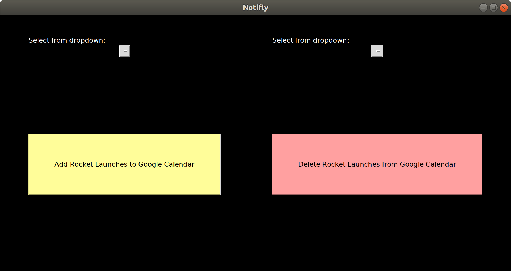

# Spacex-calender

# Notifly

Notifly is a Python application that automatically adds upcoming rocket launches to your Google Calendar.

## Prerequisites

- Python 3.0 or higher

## GUI Overview

Upon first startup of `main.py`, the GUI should look like this:




## Functionality

## Setup Guide


1. **Clone the Repository**
   Clone this repository to your local machine.

2. **Google Calendar API Setup**
   - Visit the [Google Calendar API Quickstart](https://developers.google.com/calendar/quickstart/python) website.
   - Follow steps 1 and 2 to create your project and download the `credentials.json` file.
   - Save the `credentials.json` file in the same directory as the Python scripts.
   - If your JSON file is not named `credentials.json`, update the `api_credentials_json` variable in `notifly.py` accordingly.

3. **Install Dependencies**
   - Install the BeautifulSoup library:
     ```bash
     pip install beautifulsoup4
     ```
   - Install the Tkinter library:
     ```bash
     sudo apt-get install python3-tk
     ```
     Or follow the instructions on the [Tkinter installation guide](https://tkdocs.com/tutorial/install.html).

4. **Run the Application**
   Execute the following command to start the GUI:
   ```bash
   python3 main.py
